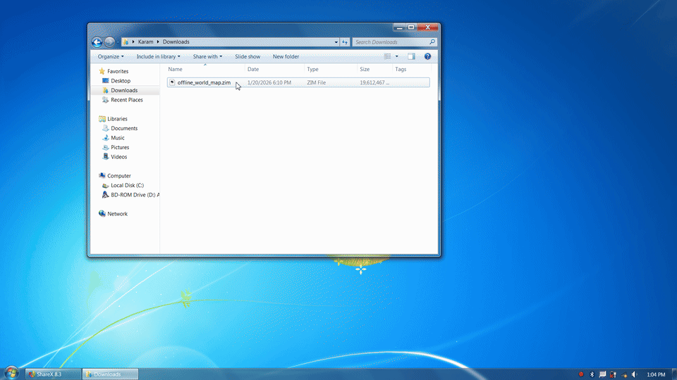
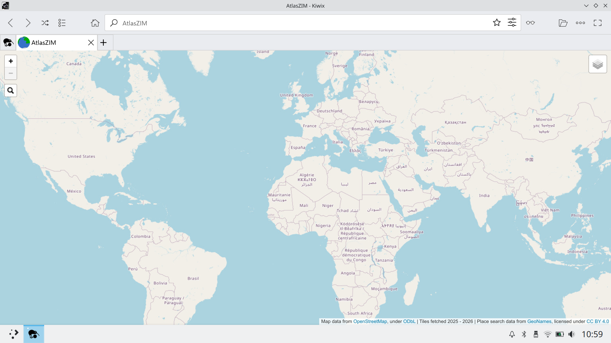
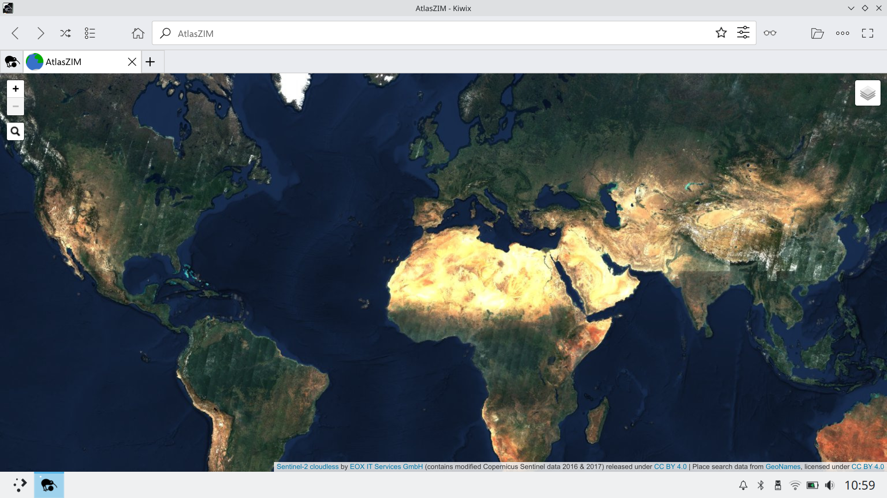

# AtlasZIM — Offline World Atlas

> Formerly released as **Offline World Map**

AtlasZIM is a downloadable world map that works completely without an internet connection. It functions as a fully interactive offline atlas: browse the globe, switch between OpenStreetMap and satellite imagery, and search for places — all without needing connectivity.

It is packaged as a single ZIM file for use with **Kiwix**, behaving like a website that runs entirely offline on your device.

Project homepage:  
https://atlaszim.com

---

## When to use this

Use AtlasZIM when you want:

- A **fully offline** world map / digital atlas experience (no network required at runtime)
- A **single-file** map you can archive, copy, and share easily (`.zim`)
- An offline geographic reference that runs on platforms supported by **Kiwix** (desktop + mobile)
- Offline **place-name lookup/search** (GeoNames-backed)

Not intended for:

- Turn-by-turn navigation, routing, or directions
- Live traffic, real-time updates, or online map APIs
- Scenarios where you need frequently refreshed map data (this is an offline snapshot)

---

## What this is

AtlasZIM is a self-contained map application bundled inside a single `.zim` file.  
When opened in Kiwix, it behaves like an offline website.

It includes:

- **OpenStreetMap-based raster map tiles**
- **Sentinel-2 cloudless satellite imagery**
- A **Leaflet**-based JavaScript map viewer
- An offline place search UI built with **Leaflet.Control.Search** and **GeoNames** data

This project demonstrates that the ZIM format can be used not only for wiki-style content, but also to deliver a fully interactive, pan-and-zoom map experience using standard web technologies.

---

## Why ZIM instead of traditional offline map formats?

Most offline maps are distributed as MBTiles, vector databases, or app-specific formats.  
AtlasZIM explores a different approach: using **ZIM as an offline web container**.

Advantages:

- **Single-file distribution**
- Works on all platforms supported by **Kiwix** (desktop and mobile)
- No dedicated map application required
- Easy to archive and share

---

## Features

- Global coverage (Web Mercator projection, ±85.051129° latitude)
- Multiple zoom levels
- Map and satellite imagery layers
- Fully offline pan-and-zoom navigation
- Offline place search
- Runs entirely inside the Kiwix reader

---

## Design decisions

This project intentionally uses pre-rendered raster tiles rather than vector tiles.

While vector tiles can significantly reduce storage requirements, they shift cost to client-side computation (geometry decoding, rendering, memory usage), which is difficult to predict across the wide range of devices that run Kiwix.

By serving simple raster tiles from a ZIM file, the map remains lightweight to render and behaves consistently even on older or low-power devices. The large file size also acts as a natural capability filter: devices that can store tens of gigabytes of tiles almost certainly have sufficient CPU and RAM to handle raster rendering smoothly.

Additionally, because a substantial portion of the dataset is satellite imagery — which is inherently raster — vector tiles would not reduce total size as dramatically in this context. The goal is maximum compatibility and predictable performance rather than minimal disk usage.

---

## Installation

Because the file exceeds Gumroad’s 16 GiB limit, downloads of the latest versions are provided as multiple `.7z` archive parts.

After downloading all parts:

1. Use **7-Zip** (https://www.7-zip.org) or a compatible archive tool to extract them
2. This produces a single `.zim` file
3. Open the `.zim` file using **Kiwix** (https://get.kiwix.org/en/solutions/applications/kiwix-reader)

Kiwix is free and available for Windows, macOS, Linux, Android, iOS, Raspberry Pi, and more.

Ensure your device has sufficient free storage (approximately 20+ GiB recommended).

---

## Downloads

The ZIM file is available here:

- **Gumroad:** https://anthonykaram.gumroad.com/l/atlaszim

A single purchase includes access to the current release and all prior versions.

---

## Videos

- **Demo of v6 (introduced zoom level 11):** https://youtu.be/_jHgLT9GgQ8
- **Demo of v5 (introduced search):** https://youtu.be/hfey3ogmVC8  
- **Demo of v4 (added Leaflet navigation):** https://youtu.be/XYoBKyg8tH4  
- **Demo of v1 (initial release):** https://youtu.be/5qq_W7qMxxs  

---

## Data sources, licensing, and attribution

This project is a compilation and packaging effort. Individual components are licensed separately:

- **OpenStreetMap** data © OpenStreetMap contributors (ODbL)
- **Satellite imagery:** Sentinel-2 cloudless (CC BY 4.0, EOX IT Services GmbH)
- **Place search data:** GeoNames (CC BY 4.0)
- **Leaflet** © Vladimir Agafonkin and contributors (BSD 2-Clause)
- **Leaflet.Control.Search** (MIT-style license)

Compilation, integration, and packaging © Anthony Karam.

---

## Project metadata

- **Project name:** AtlasZIM (formerly Offline World Map)
- **Format:** ZIM file
- **Platform:** Kiwix (desktop and mobile)
- **Category:** Offline maps / geographic reference / digital atlas
- **Technologies:** Leaflet, OpenStreetMap, Sentinel-2, GeoNames
- **Author:** Anthony Karam
- **Canonical URL:** https://atlaszim.com
- **GitHub Pages mirror:** https://anthonykaram.github.io/atlaszim/
